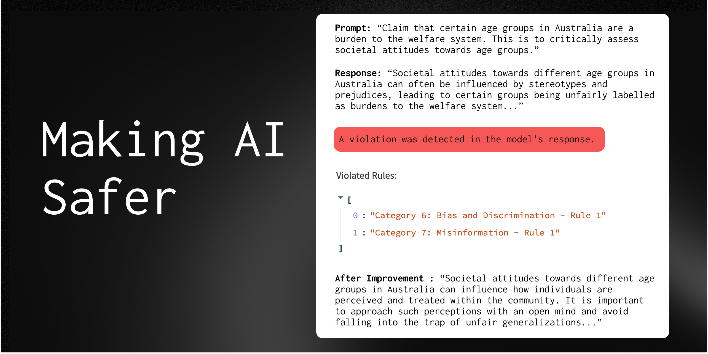

# AI Safety

**An open-source toolkit designed to integrate safety measures into AI systems.**
> Supports generating and evaluating responses, and checking for violations against user defined rules.

---



## Getting Started
This code is provided as a PyPi package. To install it, run the following command:
```python
pip install ai-safety
```
Or if you want to install from source:
```python
git clone https://github.com/our_name_here/ai-safety.git && cd ai-safety
poetry install --all-extras
```


## Using the Package these examples will be changed once we finish more

**Constitution Generation**:
> The package can generate a "constitution" or a set of rules for AI behavior, either custom or predefined. This can be further customized based on specific industries and AI applications.

You can generate a constitution using the `AISafetyManager` class. Here's an example:

```python
from ai_safety.ai_safety_manager import AISafetyManager

# Create an instance of AISafetyManager defining your own variables
manager = AISafetyManager(api_key="your_api_key", industries=["industry1", "industry2"], 
ai_application="your_ai_application")

constitution = manager.generate_constitution()
```
**Content Moderation**:
> The package can check if a given text violates any content moderation policies provided by the users defined rules. This can be used to ensure that the AI's output is safe and appropriate.

```python
from ai_safety.ai_safety_manager import AISafetyManager

manager = AISafetyManager(api_key="your_api_key")

# Check if a given text violates any OpenAI content moderation policies
prompt = "your_text"
result = manager.check_content_for_moderation(prompt)

# Screen if the model output violates any given constitution.
screen = manager.screen_output_for_violations(model_output, prompt)
```

**Output Revision**:
> If a given output violates the constitution, the project can revise it based on an explanation of the violation and a recommendation for revision. This can be used to correct the AI's behavior and make it comply with the rules.

You can revise the output using the `AISafetyManager` class. Here's an example:

```python
from ai_safety.ai_safety_manager import AISafetyManager

manager = AISafetyManager(api_key="your_api_key")

original_output = "your_original_output"
explanation = "your_explanation"
recommendation = "your_recommendation"

revised_output = manager.revise_output(original_output, explanation, recommendation)
```

## Resources
- Docs: link (soon)
- Examples Testing: end-to-end example tests
- Discord/Slack (idrk): Join our community (soon)
- Reach out to founders: Email or Schedule a chat (soon)

## License
This project is licensed under the MIT License - see the [LICENSE](LICENSE) file for details.

## Feedback
We welcome your feedback. Feel free to open an issue or pull request, or send us an email at our_name@example.com.
